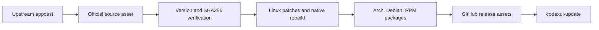

# Architecture

## English

Codex UI Linux Port is packaging automation around upstream Codex UI release artifacts. It does not own or modify upstream product behavior beyond Linux packaging patches required for desktop integration.



```text
Upstream appcast
  -> Official source asset
  -> Version and SHA256 verification
  -> Linux patches and native rebuild
  -> Arch, Debian, and RPM packages
  -> GitHub release assets
  -> codexui-update
```

## Components

- `scripts/build-from-dmg`: extracts the official source asset, rebuilds native modules, applies Linux patches, and produces packages.
- `scripts/build-packages`: creates Arch, Debian, and RPM package outputs from a prepared package root.
- `scripts/validate-release-artifacts`: validates the expected release asset set and checksums.
- `scripts/codexui-update`: detects the host package manager, downloads the matching package, verifies checksums, installs, and can smoke-test.
- `tools/`: pinned Node.js tooling for reproducible native module rebuilds.
- `packaging/`: package metadata templates.
- `docs/`: usage, packaging, security, publication, and AUR notes.

## Trust Boundaries

- Upstream Codex UI assets remain governed by upstream owners and terms.
- Repository-authored automation and packaging metadata are separate from upstream software.
- Release artifacts are generated by GitHub Actions as the authoritative builder.
- Local runtime data, chats, credentials, and extracted app trees must not enter git.

---

# Arquitectura

## Español

Codex UI Linux Port es automatización de empaquetado alrededor de artefactos upstream de Codex UI. No posee ni modifica el comportamiento del producto upstream más allá de patches de empaquetado necesarios para integración Linux.

## Componentes

- `scripts/build-from-dmg`: extrae el artefacto oficial, recompila módulos nativos, aplica patches Linux y produce paquetes.
- `scripts/build-packages`: crea salidas Arch, Debian y RPM desde un package root preparado.
- `scripts/validate-release-artifacts`: valida el conjunto esperado de assets de release y checksums.
- `scripts/codexui-update`: detecta el gestor de paquetes del host, descarga el paquete compatible, verifica checksums, instala y puede ejecutar smoke test.
- `tools/`: tooling Node.js fijado para recompilar módulos nativos de forma reproducible.
- `packaging/`: plantillas de metadata de paquetes.
- `docs/`: notas de uso, empaquetado, seguridad, publicación y AUR.

## Límites de confianza

- Los assets upstream de Codex UI siguen gobernados por sus propietarios y términos.
- La automatización y metadata de empaquetado del repo están separadas del software upstream.
- GitHub Actions es el builder autoritativo de artefactos de release.
- Datos runtime locales, chats, credenciales y árboles de app extraídos no deben entrar en git.
